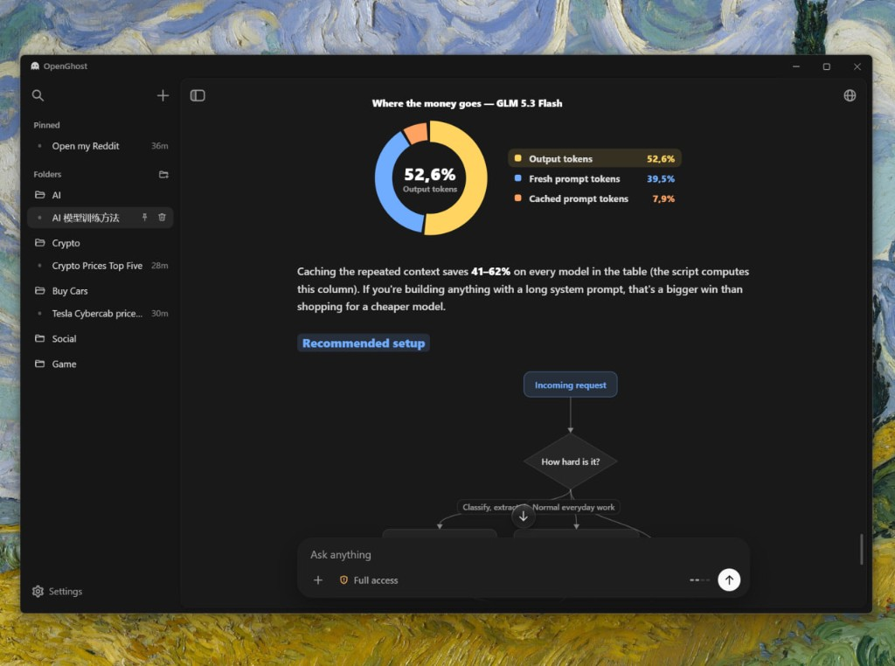
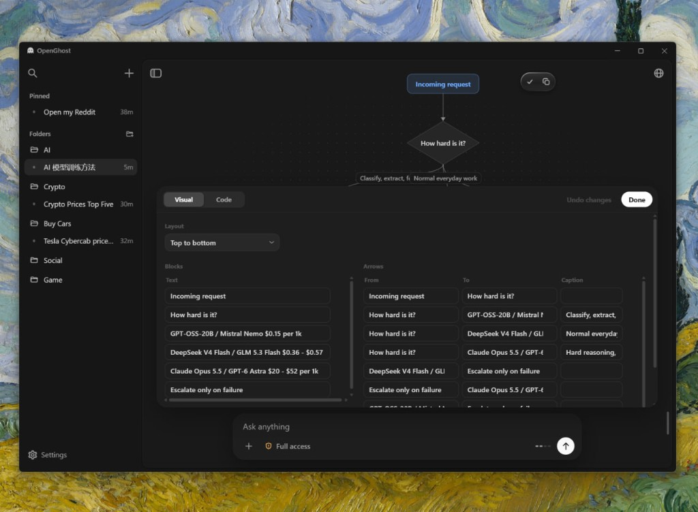
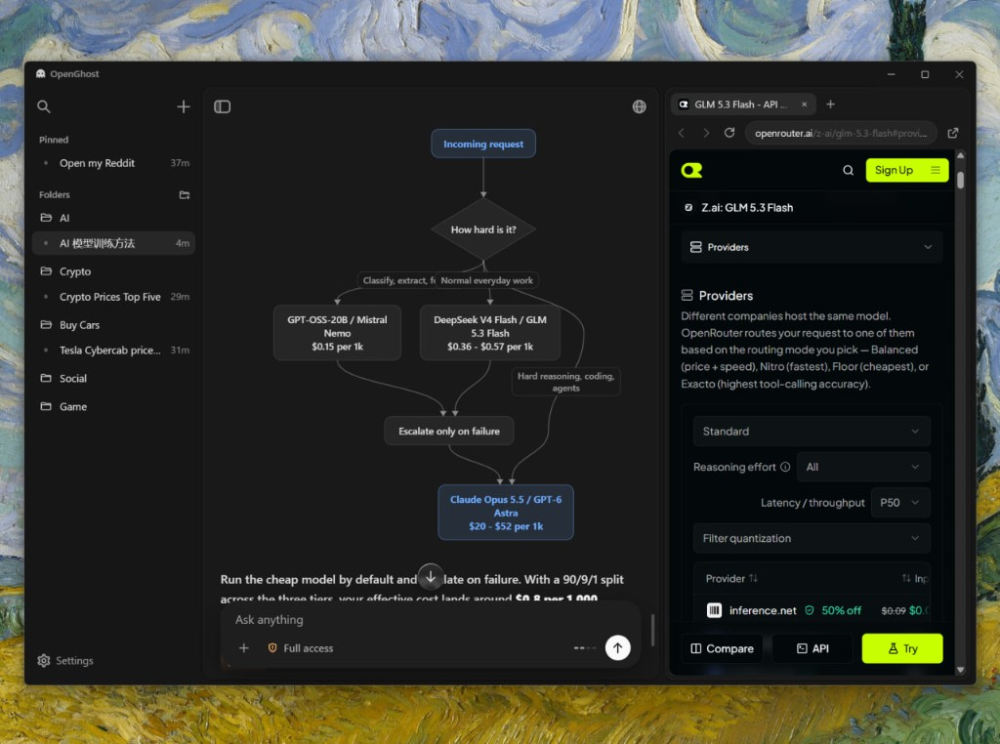
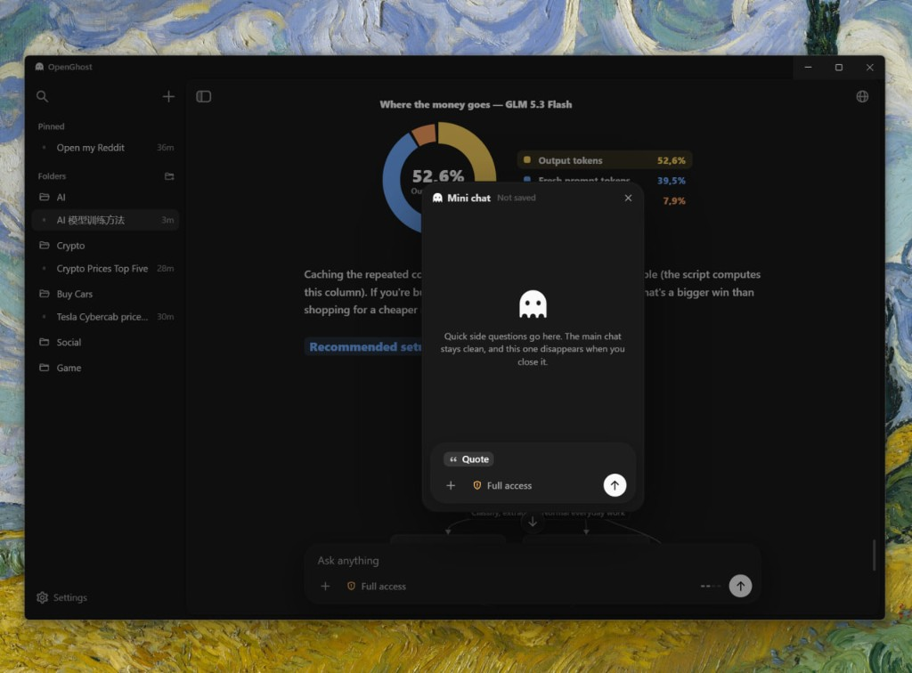
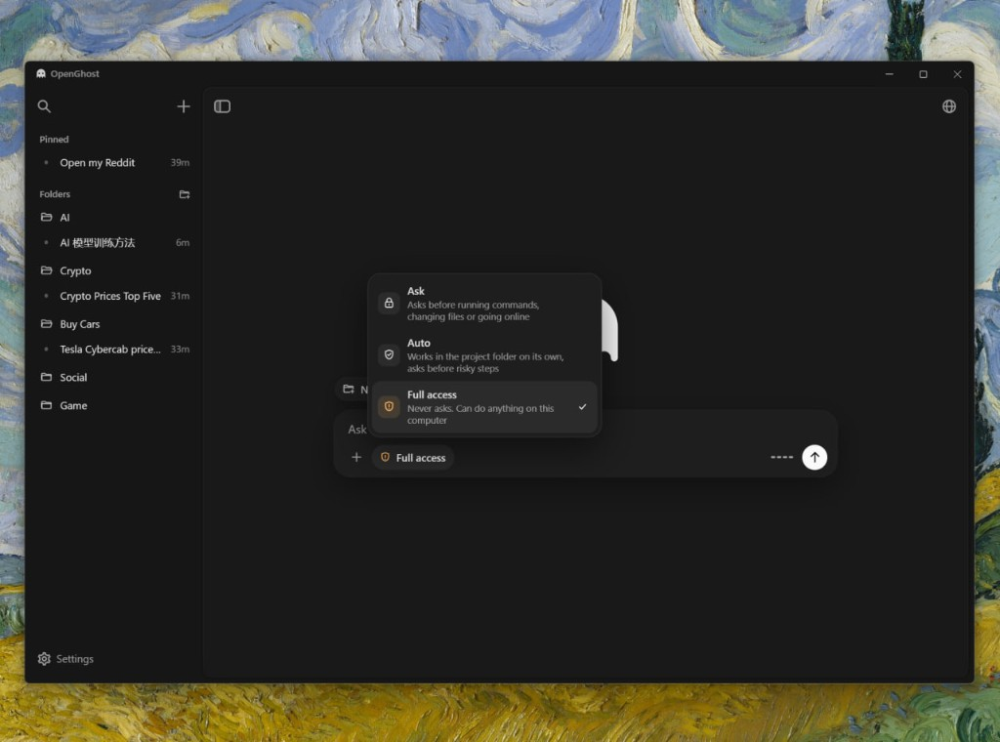
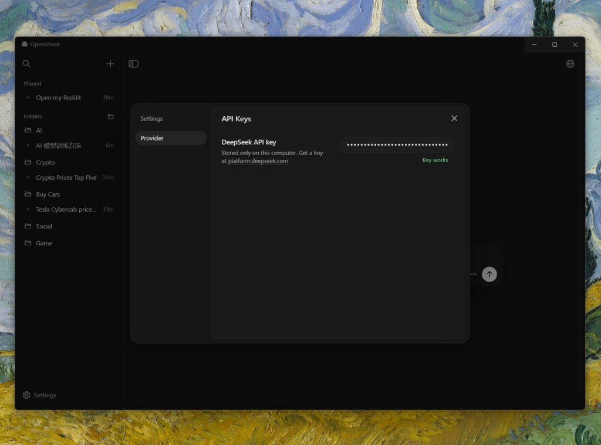

# Open Shadow

**v1.1.0 beta**

Open Shadow is an open desktop agent for Windows, Linux and macOS. The agent engine is written
from scratch. It runs commands, edits files, keeps git, and works on the web. Its main advantage
is visualization: when something can be shown, Open Shadow draws it. The rendering engine is
written from scratch too.

This project is a fork of [OpenGhost](https://github.com/ANDRETRIPOL/OpenGhost) (MIT). The source
code is shared under the MIT license; the Open Shadow name, the Umbra marks, the sprites and the
opening animation are original to this fork. See [LICENSE](LICENSE) and
[Differences from the upstream project](#differences-from-the-upstream-project).

## Providers

Every provider keeps its key or sign-in on this machine. The app checks them for you.

| Provider | Notes |
|---|---|
| DeepSeek | in-page renderer |
| OpenAI | Responses API |
| ChatGPT | Codex backend, sign in with your account |
| Anthropic | Claude, Anthropic SDK |
| Xiaomi MiMo | `mimo-v2.6-pro`, `mimo-v2.6-flash`, `mimo-v2.6-pro-ultraspeed`, `mimo-v2.5-pro`, `mimo-v2.5` |
| Moonshot Kimi | Chat Completions |
| Qwen (DashScope) | Chat Completions |
| Groq | Chat Completions |
| OpenRouter | Chat Completions |
| xAI Grok | Chat Completions |
| Google Gemini | Chat Completions |
| Custom | any OpenAI-compatible base URL and model id |

## It opens on the Umbra orb

The app starts on its own screen. A drop falls, the orb forms, its motes ignite, and the name
**Open Shadow** rises. Skip it with a click or any key.

## A chat lives in a folder

Every new chat belongs to a folder you choose. Until the first message, the orb waits above the
composer.

## Show the numbers, do not only tell them

Shares, flows, prices, and plans become charts and diagrams next to the explanation. One picture
carries the idea.

## Change the diagram where it stands

A chart is not a finished picture. Open it and edit the layout, the blocks, and the arrows. The
drawing updates in place.

## A browser with its own cursor

Open Shadow has a built-in browser and drives it itself. It opens a page, moves its own cursor,
clicks, types, and sees what is on the screen. The panel sits on the right of the chat. Close it
and the agent still works.

## Mini chat for a side question

Select a passage and open Mini chat over the conversation. It is the same agent, with the current
chat as context. Nothing written there is saved, and closing the window throws it away.

## Three ways to let it act

Ask waits for approval before commands, file changes, and the web. Auto works inside the project
folder and asks before a risky step. Full access does not ask.

## The key stays on this computer

Keys and sign-ins are stored only on your machine. The settings screen connects every provider
above and shows which ones are ready.

## Differences from the upstream project

Open Shadow is a fork of [OpenGhost](https://github.com/ANDRETRIPOL/OpenGhost), which is MIT
licensed. What this fork changes:

- **Identity.** Open Shadow, its Umbra eclipse-orb marks, its agent sprite and its opening
  animation replace the upstream product name, logo, sprites and visuals. None of the upstream
  Ghost artwork is used here.
- **Providers.** The upstream app could only reach OpenAI, ChatGPT, Anthropic and DeepSeek. This
  fork adds the OpenAI Chat-Completions providers listed above (MiMo, Moonshot, Qwen, Groq,
  OpenRouter, xAI, Gemini) plus a custom OpenAI-compatible endpoint.
- **Build metadata.** The npm name, app id and installer artifact names are `openshadow`,
  `com.openshadow.app` and `OpenShadow-*`.

## Credit

This application is a fork of **OpenGhost** by Andrew, distributed under the MIT License. The
original MIT copyright notice is kept verbatim in [LICENSE](LICENSE). The upstream product name,
logo, animations and visual design are excluded materials that this fork does not use.
